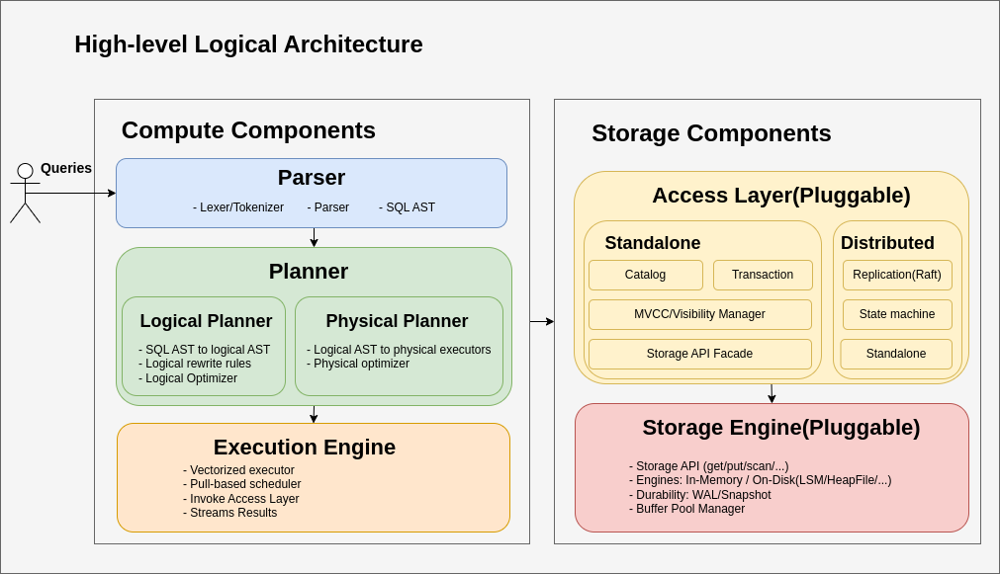

# sboxdb Architecture

`sboxdb` is designed as modular and pluggable so that it can be change easily to experiment with different
implementation on different modules.

## High-Level Logical Architecture

## Compute Components

### Parser

- Converts SQL queries into an Abstract Syntax Tree (AST).
- Includes a hand-crafted lexer/tokenizer and parser.
- Supports basic SQL syntax: projections, filters, joins, aggregates, and transactions.

### Planner

- **Logical Planner**: Transforms SQL AST to logical plans, applies rewrite rules, and logical optimizations.
- **Physical Planner**: Converts logical plans to physical executors, applies physical optimizations.

### Execution Engine

- Executes the physical plan using vectorized executor.
- Uses a pull-based vectorized execution scheduler.
- Invokes the storage access layer and streams results to the client.

## Storage components

### Access Layer

- Pluggable access layer
- Provides transactional catalog and data access with **Snapshot isolation** to storage engine.
- **Standalone Mode**: Direct access to catalog, transaction manager, MVCC/visibility manager, and storage API.
- **Distributed Mode**: Uses Raft-based linearizable replication state machine apply command to storage engine
  transactionally.

### Storage Engine(Pluggable)

- Implements the core storage API (get, put, scan, etc.).
- Supports multiple backends: in-memory, LSM-based (WIP), and future extensions (parquet, heap file).
- Ensures durability via Write-Ahead Logging (WAL) and snapshot mechanisms(**TODO**).
- Includes buffer pool management for efficient data access(**TODO**).

